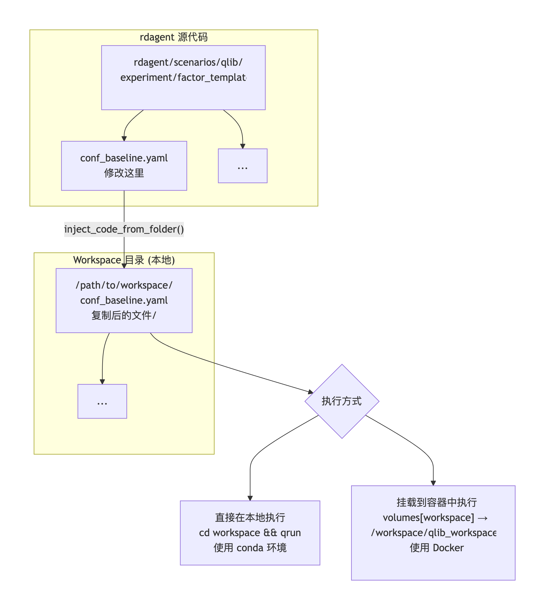

## 检查local_qlib:latest是否存在
修改env.py中 DockerEnv 类的prepare 方法， 替换 /root/anaconda3/envs/rdagent/lib/python3.10/site-packages/rdagent/utils/env.py

## 使用自定义数据
修改 factor_data_template 
    generate.py 中的provider_uri 、日期参数、字段获取逻辑
    README.md: 字段解释信息。
       $close, $open, $high, $low, $volume 的解释补充复权表述（ajusted）
替换 /root/anaconda3/envs/rdagent/lib/python3.10/site-packages/rdagent/scenarios/qlib/experiment/factor_data_template/

## 因子生成。替换回测数据源及日期
修改 factor_template 中模版信息。替换 /root/anaconda3/envs/rdagent/lib/python3.10/site-packages/rdagent/scenarios/qlib/experiment/factor_template 下模版

## 环境使用说明。rdagent / local_qlib(docer) / rdagent4qlib(conda)
- 因子代码生成：FACTOR_CoSTEER_*，当前激活环境（如 rdagent）
- Qlib 回测执行：MODEL_CoSTEER_env_type=[conda/docker]。这里的环境仅提供Qlib库和python编译环境。 实际的配置文件，如factor_data_template 是由rdagent复制 workspace并作用于回测过程。

[//]: # (![pic]&#40;./env_docer_conda.png&#41;{:width="300px" height="200px"})

## ui展示错误。
- 在Web端，第一轮迭代收益曲线表展示有误。
- 修改脚本：anaconda3/envs/rdagent/lib/python3.10/site-packages/rdagent/log/ui/app.py
- 修改内容：将fig = report_figure(fbr[0].content) 修改为 fig = report_figure(fbr[-1].content)

